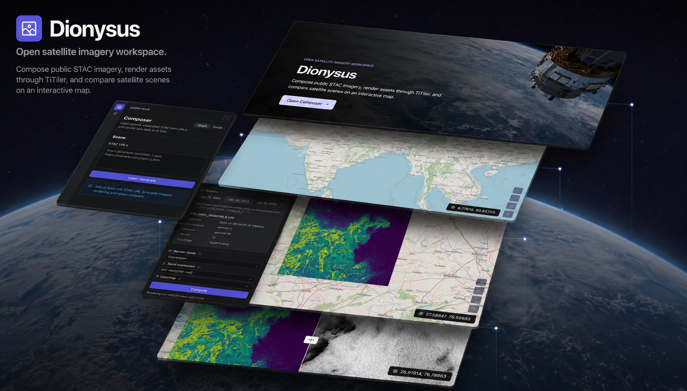

# Dionysus

<p align="center">
  
</p>

<p align="center">
  <strong>A local-first satellite imagery composer for public STAC items.</strong>
</p>

<p align="center">
  <a href="https://github.com/neelduttahere/Dionysus">Source Code</a>
  ·
  <a href="#installation">Installation</a>
  ·
  <a href="#configuration">Configuration</a>
  ·
  <a href="#license">License</a>
</p>

<p align="center">
  
  
  
  
  
</p>

---

Dionysus is a browser-based workspace for loading public satellite imagery from
STAC item URLs, rendering those assets through TiTiler, and comparing scenes on
an interactive map.

The current v1 release is focused on **local Docker usage**. A hosted GitHub
Pages demo is planned, but not enabled yet.

---

## Features

- Load comma-separated public STAC item URLs.
- Sort scenes by acquisition date.
- Render one active scene at a time.
- Inspect scene metadata, constellation/platform, band count, and footprint area.
- Render single-band assets with TiTiler statistics-based contrast.
- Compute TiTiler band expressions and apply matplotlib colormaps.
- Compare two scenes or render configurations with swipe mode.
- Inspect TiTiler tile request health with the map diagnostics panel.
- Configure a local or remote TiTiler endpoint from the UI.
- Use OpenStreetMap or a custom XYZ basemap URL.
- Share composer state through `/map/compose`.

## What Is Underneath

Dionysus is a client-side React application. It does not run an application
backend of its own.

```text
STAC Item URL(s)
    -> browser fetches and parses STAC metadata
    -> Dionysus extracts assets, dates, bands, geometry, and area
    -> TiTiler creates statistics and TileJSON responses
    -> MapLibre renders raster tiles on the map
    -> tile diagnostics records TiTiler /tiles request status and timing
```

For local Docker usage, `docker compose` starts:

- the Vite React frontend
- a local TiTiler container

The frontend defaults to the local TiTiler endpoint in Docker:

```text
http://localhost:8000
```

User preferences such as TiTiler endpoint, basemap, custom XYZ URL, and area
unit are stored in browser local storage. Composer state is encoded in the URL
so a configured scene can be shared.

## Packages And Libraries

| Area | Tools |
| --- | --- |
| Frontend | React, Vite, TypeScript |
| Routing and data | TanStack Router, TanStack Query, Axios |
| UI | Radix Themes, Radix Icons |
| Mapping | MapLibre GL, react-map-gl, deck.gl |
| Geospatial | TiTiler, STAC, Turf.js |
| Tooling | pnpm, Biome, Prettier, Docker Compose |

## Installation

### Docker

This is the recommended v1 workflow.

```bash
git clone https://github.com/neelduttahere/Dionysus.git
cd Dionysus
docker compose up --build
```

Open the app:

```text
http://localhost:5173
```

Running services:

| Service | URL |
| --- | --- |
| Frontend | `http://localhost:5173` |
| TiTiler | `http://localhost:8000` |

### Frontend Only

Use this if TiTiler is already running somewhere else.

```bash
git clone https://github.com/neelduttahere/Dionysus.git
cd Dionysus
pnpm install
pnpm dev
```

Open:

```text
http://localhost:5173
```

The default non-Docker TiTiler endpoint is:

```text
https://titiler.xyz
```

To change it before startup:

```bash
cp .env.example .env
```

```text
VITE_DEFAULT_TITILER_URL=http://localhost:8000
VITE_BASE_PATH=/
```

## Usage

1. Start Dionysus with Docker or `pnpm dev`.
2. Open `http://localhost:5173`.
3. Go to Composer.
4. Paste one or more public STAC item URLs.
5. Click `Load / Generate`.
6. Use the timeline to move between loaded scenes.
7. Choose a render mode:
   - `Default`
   - `Single band`
   - `Expression`
8. Use `Swipe` mode to configure left and right scenes independently.
9. Open `Tile Diagnostics` from the top-right map control to inspect TiTiler
   tile requests.

### Tile Diagnostics

Tile rendering can be slow when TiTiler is reading large Cloud Optimized
GeoTIFFs, computing expression tiles, or fetching remote STAC assets. Dionysus
includes a diagnostics panel for the raster tile requests made by the map.

The diagnostics panel shows:

- full TiTiler `/tiles` request URLs
- pending tile requests
- successful tile requests
- cancelled tile requests
- failed tile requests and error status
- request timing

Use `Clear` to reset the diagnostics list while testing a new scene, render
mode, expression, basemap position, or TiTiler endpoint.

## Demo Data

Use these public Element 84 Sentinel-2 L2A STAC items to try Dionysus.

```text
https://earth-search.aws.element84.com/v1/collections/sentinel-2-l2a/items/S2A_43RGM_20240131_0_L2A,
https://earth-search.aws.element84.com/v1/collections/sentinel-2-l2a/items/S2A_44RKS_20240131_0_L2A,
https://earth-search.aws.element84.com/v1/collections/sentinel-2-l2a/items/S2A_43RGN_20240131_0_L2A,
https://earth-search.aws.element84.com/v1/collections/sentinel-2-l2a/items/S2A_44RKT_20240131_0_L2A,
https://earth-search.aws.element84.com/v1/collections/sentinel-2-l2a/items/S2B_43RFL_20240129_0_L2A,
https://earth-search.aws.element84.com/v1/collections/sentinel-2-l2a/items/S2B_43RGL_20240129_0_L2A
```

Sentinel-2 L2A expression examples using Element 84 asset names:

| Index | Purpose | Expression |
| --- | --- | --- |
| NDVI | vegetation | `(nir-red)/(nir+red)` |
| NDWI | water | `(green-nir)/(green+nir)` |
| NDMI | moisture | `(nir-swir16)/(nir+swir16)` |
| NDBI-style | built-up areas | `(swir16-nir)/(swir16+nir)` |
| NBR | burn severity | `(nir-swir22)/(nir+swir22)` |
| Red-edge NDVI | vegetation variant | `(nir08-red)/(nir08+red)` |

Best first expression test:

```text
(nir-red)/(nir+red)
```

## Configuration

### TiTiler Endpoint

Open the Settings panel and update `TiTiler endpoint`.

Examples:

```text
http://localhost:8000
https://titiler.xyz
https://your-titiler.example.com
```

Use a local TiTiler endpoint for Docker-based local work. Use a remote endpoint
only when it can access the STAC assets you are trying to render.

### XYZ Basemap

Open the Settings panel and choose:

- `OpenStreetMap`
- `Custom XYZ`

Custom XYZ URLs must include `{z}`, `{x}`, and `{y}` placeholders.

```text
https://tile.openstreetmap.org/{z}/{x}/{y}.png
https://your-tile-server.example.com/{z}/{x}/{y}.png
```

### Area Units

The Settings panel can display footprint area as:

- square kilometers
- square meters
- hectares
- acres

## Development

```bash
pnpm dev
pnpm check
pnpm build
pnpm format
pnpm preview
```

## Project Structure

```text
src/
  api/          TiTiler and STAC request functions
  components/   presentational UI components
  config/       runtime defaults
  containers/   route-aware orchestration components
  hooks/        API, preference, theme, and composer hooks
  routes/       TanStack Router route components
  types/        shared TypeScript types
  utils/        STAC, geometry, URL, and TiTiler utilities
```

## Status

Current v1 scope:

- local Docker workflow
- STAC item loading
- default visual rendering
- single-band rendering
- expression rendering
- tile diagnostics
- timeline navigation
- swipe compare
- custom TiTiler endpoint
- custom XYZ basemap

Planned later:

- GitHub Pages demo
- Force TCI asset mode
- RGB composite builder
- STAC provider presets
- additional map tools

## License

See [LICENSE](./LICENSE).

## Credits

Dionysus uses and builds on:

- [TiTiler](https://github.com/developmentseed/titiler), by Development Seed
- [STAC](https://stacspec.org/)
- [OpenStreetMap](https://www.openstreetmap.org/)
- [MapLibre GL](https://maplibre.org/)
- [deck.gl](https://deck.gl/)
- [Turf.js](https://turfjs.org/)
- React, Vite, TanStack, Radix, Axios, Biome, Prettier, and pnpm

Satellite imagery and metadata belong to their respective providers. Make sure
the STAC items and tile services you use are public and allowed for your use
case.
